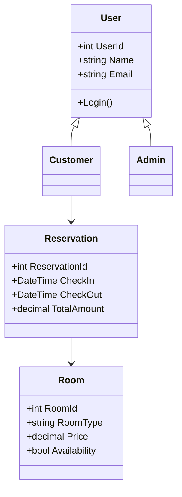
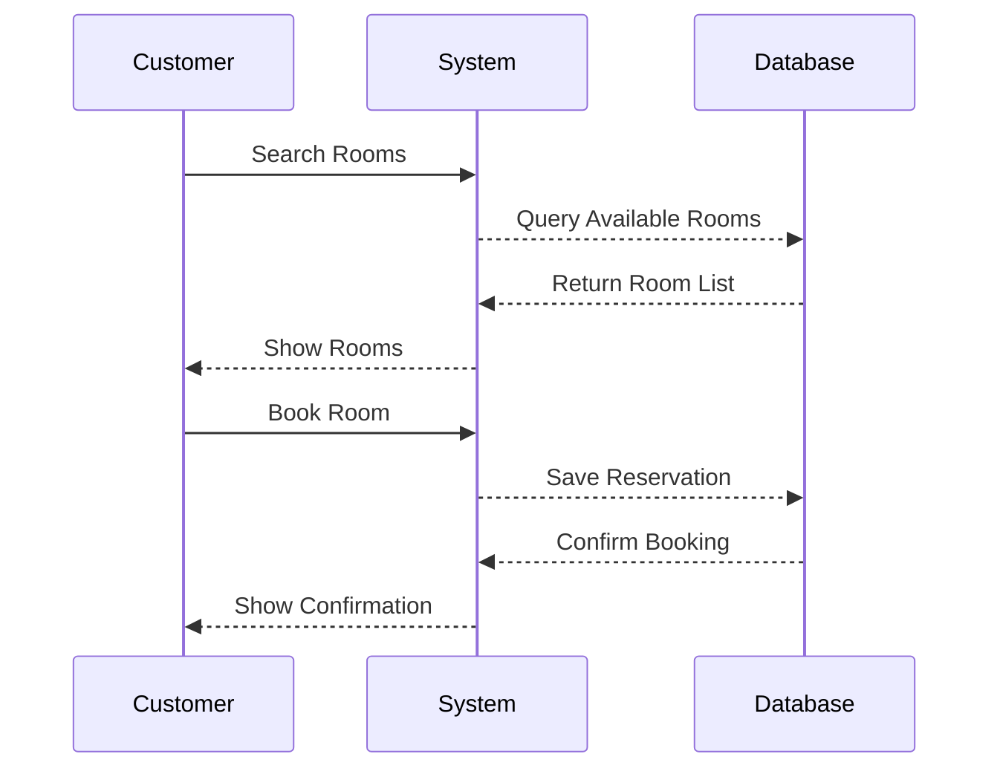

# 4. Diagrams
## 4.1 Use Case Diagram
```mermaid
usecaseDiagram
actor Customer
actor Admin

Customer --> (Search Rooms)
Customer --> (Make Reservation)
Customer --> (Cancel Reservation)
Customer --> (Payment)
Admin --> (Manage Rooms)
Admin --> (Generate Reports)
```

## 4.2 Class Diagram


## 4.3 Sequence Diagram

