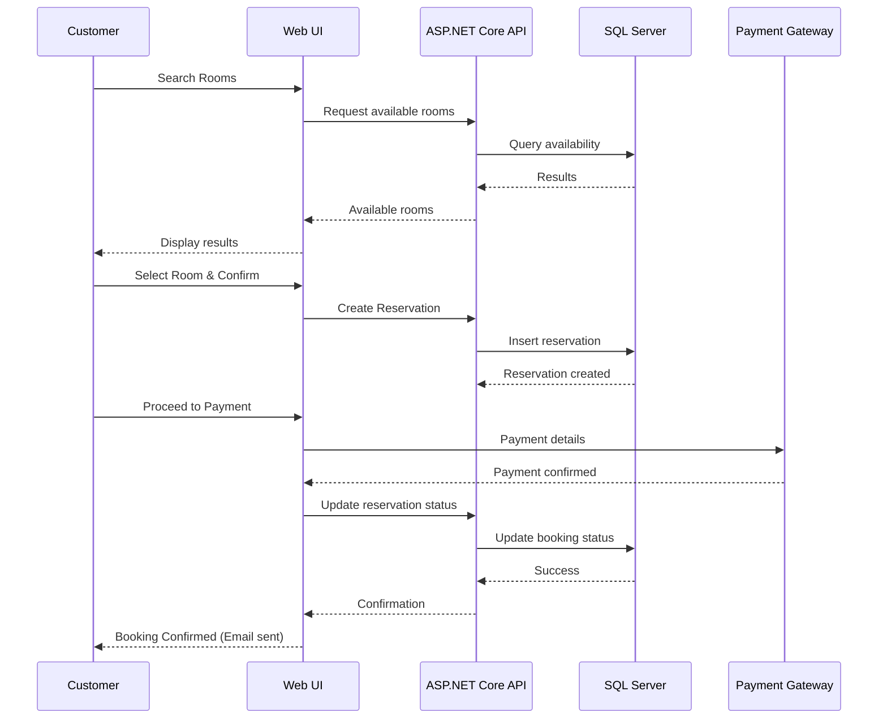

# Software Requirements Specification (SRS)  
**Project Title:** Hotel Reservation System  
**Technology:** C# .NET Core (ASP.NET Core MVC/Web API, SQL Server)  
**Version:** 1.0  
**Date:** August 2025  
**Author:** Khaled Mohamed Fathalla  

---

## 📘 Cover Page

**Hotel Reservation System**  
Software Requirements Specification (SRS)  
Developed in **C# .NET Core**

---

## 1. Introduction  

### 1.1 Purpose  
This document defines the software requirements for the **Hotel Reservation System**. It ensures all stakeholders (developers, customers, and hotel administrators) share a common understanding of the system’s features, scope, and constraints.  

### 1.2 Scope  
The system provides customers with the ability to:  
- Search for hotels and available rooms.  
- Book and pay for reservations online.  
- Manage bookings (cancel/modify).  

For administrators, the system enables:  
- Room and hotel management.  
- Reservation monitoring.  
- Revenue and occupancy reporting.  

The system will be developed using **C# .NET Core** and hosted on a web server with a **SQL Server** database backend.  

### 1.3 Definitions, Acronyms, Abbreviations  
- **UI**: User Interface  
- **API**: Application Programming Interface  
- **JWT**: JSON Web Token (authentication)  
- **RBAC**: Role-Based Access Control  

---

## 2. Overall Description  

### 2.1 Product Perspective  
The system is a **three-tier web application**:  
- **Presentation Layer** (ASP.NET Core MVC/Blazor)  
- **Application Layer** (ASP.NET Core Web API)  
- **Data Layer** (SQL Server)  

### 2.2 User Classes  
| User | Description | Skills Required |
|------|-------------|-----------------|
| **Customer** | End user booking rooms | Basic web navigation |
| **Admin** | Manages hotels/rooms/reservations | General IT knowledge |
| **System Admin** | Manages server, database, and security | Advanced technical skills |

### 2.3 Operating Environment  
- **OS**: Windows Server or Linux (Docker optional)  
- **Database**: SQL Server 2022  
- **Browsers**: Chrome, Firefox, Edge, Safari  
- **Framework**: ASP.NET Core 8+  

---

## 3. System Features  

### 3.1 Customer Features  
- Register/Login  
- Profile Management  
- Search available rooms  
- Book and pay for rooms  
- Cancel/modify bookings  
- Email notifications  

### 3.2 Administrator Features  
- Manage hotels and rooms  
- Manage pricing and offers  
- Approve/cancel reservations  
- Generate reports (occupancy, revenue)  

### 3.3 System Features  
- Authentication & Authorization (JWT + RBAC)  
- Payment gateway integration  
- Notifications via email  
- Secure data handling  

---

## 4. Non-Functional Requirements  

### 4.1 Performance  
- Support **500+ concurrent users**  
- Response time: < 3s for search/booking  

### 4.2 Security  
- Passwords encrypted (hash + salt)  
- TLS/SSL for communication  
- PCI-DSS compliance for payments  

### 4.3 Availability & Reliability  
- **99.5% uptime**  
- Daily database backups  

### 4.4 Usability  
- Responsive UI (desktop, tablet, mobile)  
- Simple 3-step booking flow  

### 4.5 Maintainability & Scalability  
- Modular architecture (MVC + Services)  
- Easy horizontal scaling with load balancing  

---

## 5. System Models  

### 5.1 Use Case Diagram  
```mermaid
usecaseDiagram
  actor Customer
  actor Admin
  actor "Payment Gateway" as PG

  Customer --> (Search Rooms)
  Customer --> (Book Room)
  Customer --> (Modify/Cancel Reservation)
  Customer --> (Make Payment)
  Customer --> (Receive Confirmation)

  Admin --> (Manage Rooms)
  Admin --> (Manage Reservations)
  Admin --> (Generate Reports)

  (Make Payment) --> PG
````

---

### 5.2 Entity-Relationship Diagram (ERD)

```mermaid
erDiagram
    USER ||--o{ RESERVATION : makes
    ROOM ||--o{ RESERVATION : contains
    HOTEL ||--o{ ROOM : has
    RESERVATION ||--|| PAYMENT : includes

    USER {
        int UserID
        string Name
        string Email
        string Password
        string Role
    }
    HOTEL {
        int HotelID
        string Name
        string Location
        string Description
    }
    ROOM {
        int RoomID
        int HotelID
        string Type
        decimal Price
        bool Availability
    }
    RESERVATION {
        int ReservationID
        int UserID
        int RoomID
        date CheckIn
        date CheckOut
        string Status
    }
    PAYMENT {
        int PaymentID
        int ReservationID
        decimal Amount
        date Date
        string Method
    }
```

---

### 5.3 Sequence Diagram (Room Booking Flow)



---

## 6. Appendices

### 6.1 Future Enhancements

* Mobile app integration
* Multi-language, multi-currency support
* AI recommendations for rooms/hotels

### 6.2 Glossary

* **Reservation**: Customer booking for a specific date and room.
* **Occupancy Rate**: % of available rooms booked.
* **RBAC**: Role-Based Access Control.

---

# ✅ End of Document

```
